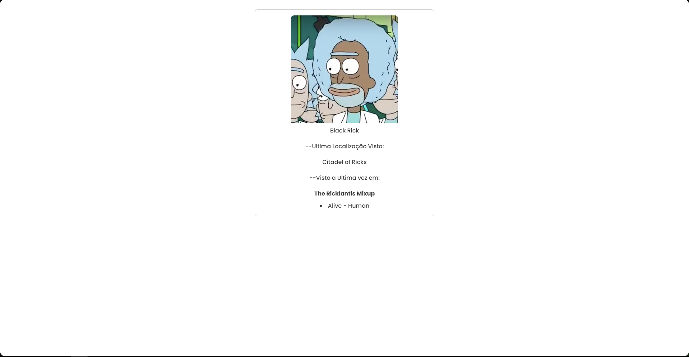
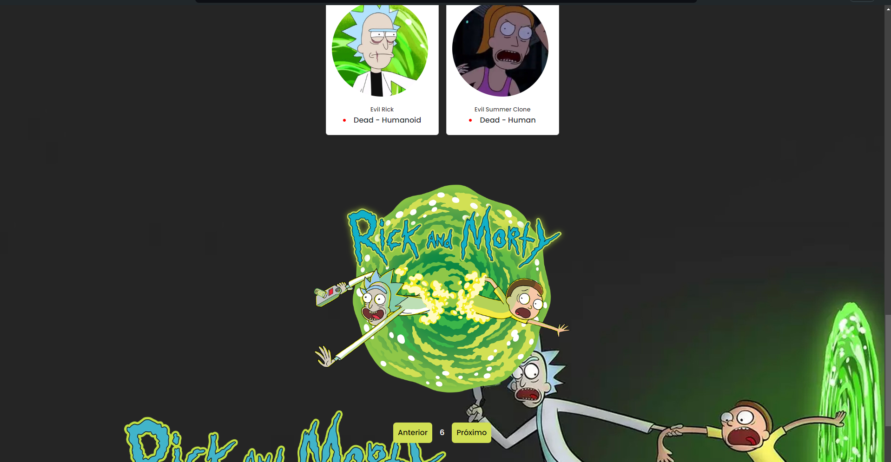
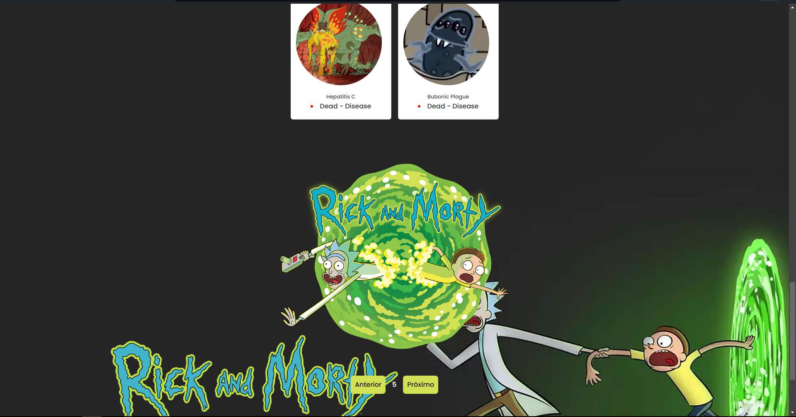
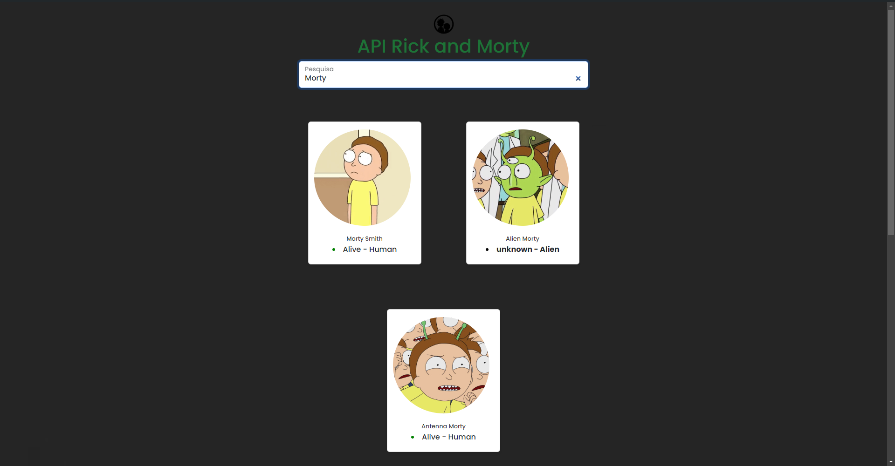

# Rick and Morty</h1>

Nesse projeto aplico os conhecimentos de consumo de API com JavaScript. [Rick and Morty API](https://rickandmortyapi.com/)
<h2>Índice</h2>

- [Sobre](#sobre)
- [Tecnologias](#🧰tecnologias)
- [Fontes](#fontes)
- [Veja a página no ar](#veja-a-página-no-ar)

## Sobre

Utilizo os métodos padrões de consumo de API, lógicas com JavaScript, utilizando `get` e tratando os dados dentro de um array, usando funções assíncronas e métodos de manipulação de array, tudo isso com o auxílio do [Axios](https://axios-http.com/ptbr/docs/intro).

Exemplo de lógica simples, abrindo uma modal, junto com Bootstrap e JS: 
  

Por conta da API disponibilizar paginação, utilizei dela também!  

Exemplo 1: 
 

Exemplo 2: 
 

Por conta das informações do `get` serem armazenadas em uma variável, aproveitei e fiz uma barra de pesquisa por personagem.

Por ser uma aplicação que fiz há algum tempo, minha lógica JavaScript estava bem redundante. Com certeza vou trabalhar nesse código futuramente, aplicando novas tecnologias.

Aproveite para ver a página no ar, aqui mesmo no github Pages.

## 🧰Tecnologias

- [HTML](https://developer.mozilla.org/pt-BR/docs/Web/HTML)
- [CSS](https://developer.mozilla.org/pt-BR/docs/Web/CSS)
- [JS](https://developer.mozilla.org/pt-BR/docs/Web/JavaScript)
- [Bootstrap](https://getbootstrap.com/)

## Fontes

- [Rick and Morty API](https://rickandmortyapi.com/)
- [Axios Documentation](https://axios-http.com/ptbr/docs/intro)

## Veja a página no ar

Você pode ver a página no ar [aqui mesmo no GitHub Pages](https://MathOlavoLuna.github.io/api-rickandmorty/).
